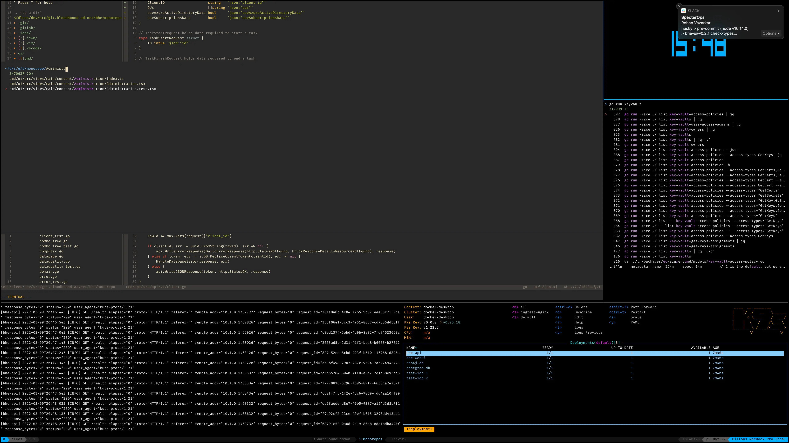
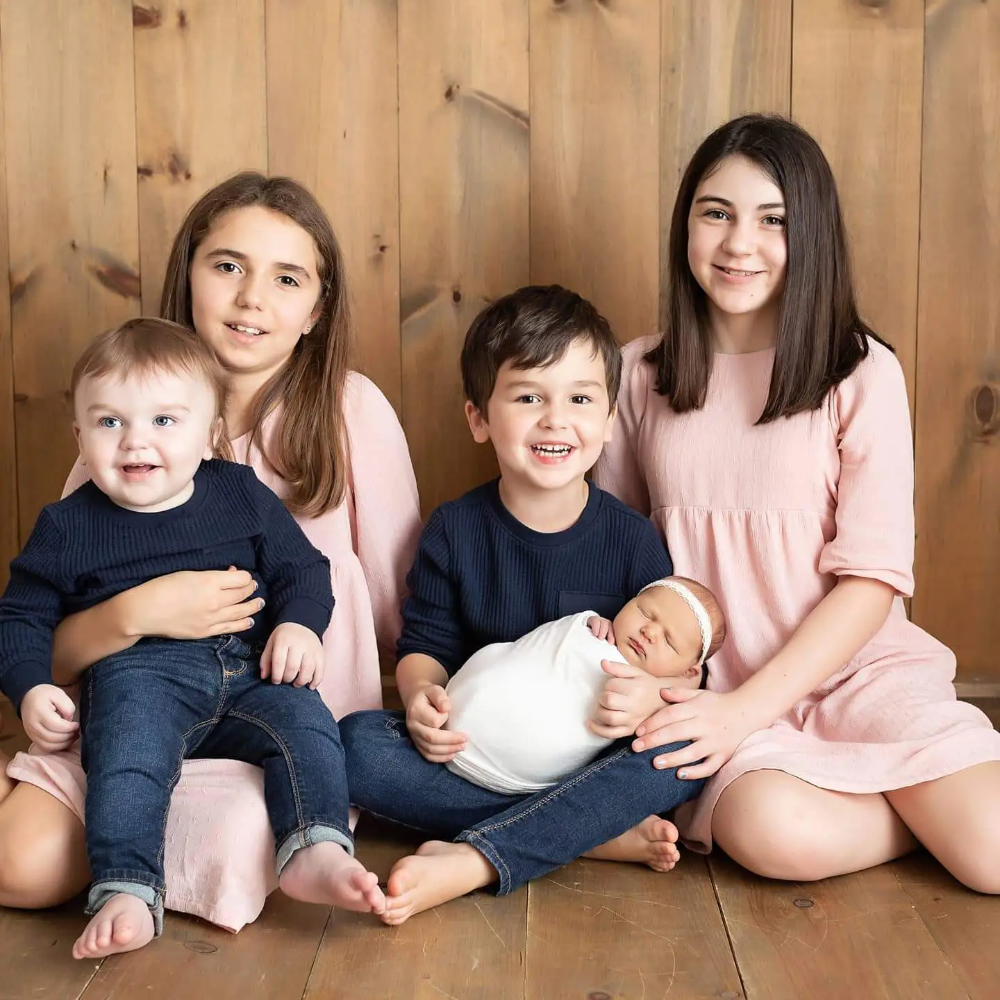
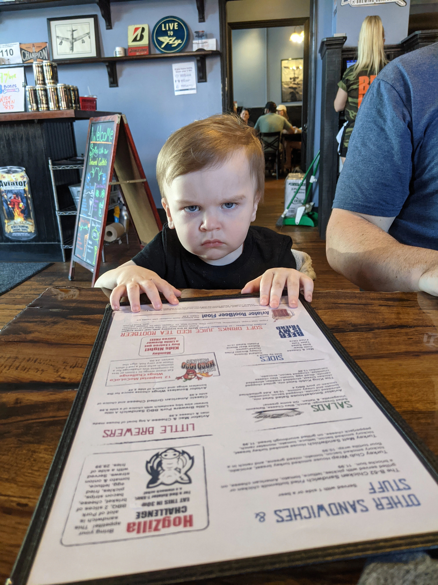

# Virtual Social Hour
presents
### Dillon Lees

<!--
Notes go here
-->

---
# Who the heck is this jabroni??

* BloodHound Enterprise Dev Team
* Father of Five
* Army Veteran
* Musician
* Super Nerd

---

## Background

* Born in Cuyahoga Falls, Ohio
* Military 2006 - 2011
  * Fort Bragg
  * Pacific Asia
* Resides in Holly Springs, North Carolina
* IBM
* SpecterOps

---

## Technological Passions and/or things I use

* All things [Kubernetes](https://kubernetes.io)
* [Merkle Trees/DAGs](https://en.wikipedia.org/wiki/Merkle_tree)
* Blockchain
* New Programming Languages
* [vim](https://www.vim.org/)/[neovim](https://neovim.io/)
* [tmux](https://github.com/tmux/tmux/wiki)
* [please](https://please.build)
* [zsh](https://www.zsh.org/)
  * [zinit](https://github.com/zdharma-continuum/zinit)
* [Bazel](https://bazel.build)

---

## What I mean when I say my terminal looks like a spaceship

---

## Susie

---

## My Kids 

---

## Archer

---
# Questions?
